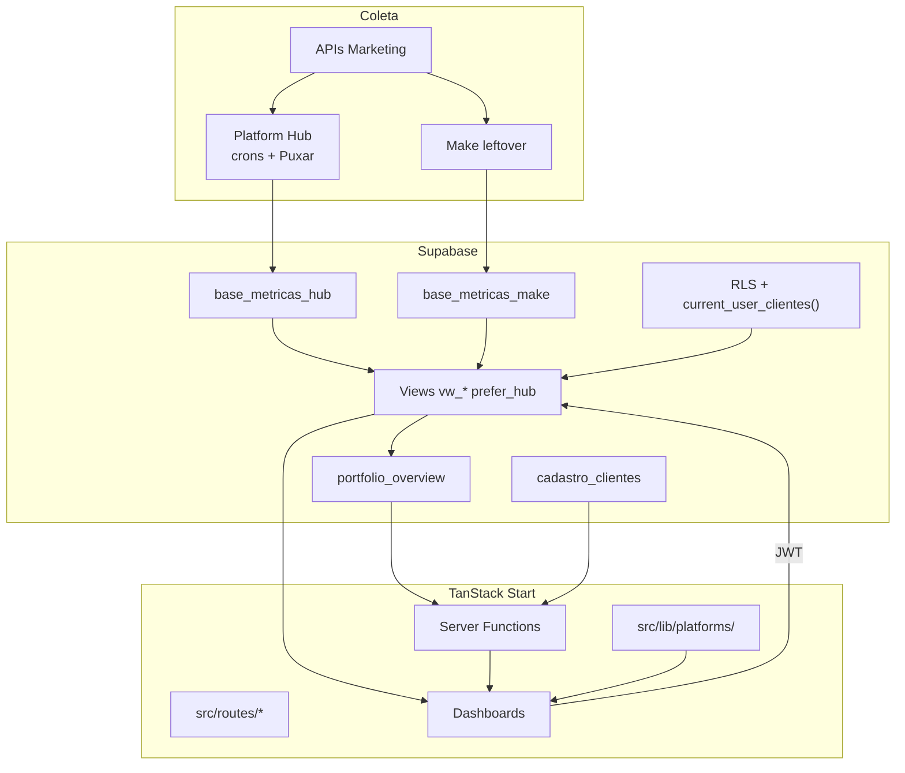

# Arquitetura — Estado Atual

> **Escopo:** fatos observáveis no repositório. Visão futura:
> [Arquitetura alvo](./target-architecture.md).

---

## Resumo

O Lots BI é uma aplicação **full-stack TypeScript** (TanStack Start + React 19) no
**Supabase Postgres**. Meta Ads e Instagram perfil entram pelo **Platform Hub**
(`base_metricas_hub` + crons). Make grava leftover em `base_metricas_make`. Google Ads e
GA4 ainda leem Make (congelado em 2026-08-17) até OAuth Hub.

Não existe servidor dedicado fora do runtime TanStack Start e do Supabase.

---

## Stack (observada em `package.json` e código)

| Camada | Tecnologia | Notas |
| ------ | ---------- | ----- |
| Framework | TanStack Start + Router | `src/routes/` |
| UI | React 19, Tailwind v4, Radix, Recharts | `src/components/lots/` |
| Estado | TanStack Query | Views + server fns |
| Backend | Server functions | `*.server.ts`, `admin.functions.ts` |
| Banco/Auth | Supabase `ywvhoctcmibjitvwkkhb` | Views `security_invoker` |
| Build | Vite 8 + Nitro | Preset Lovable transitório |
| Ingestão | **Hub official_api** + Make leftover | [current-pipeline-hub.md](../07-integrations/current-pipeline-hub.md) |
| Dev | Cursor + Git | ADR-0010 |
| Produção | **Vercel** em `https://lotsbi.leandromajr.com` | Merge em `main` publica. Cloudflare `deploy.yml` é manual, ainda não é o domínio real. |

---

## Diagrama de componentes (atual)

---

## Camadas de responsabilidade

### 1. Ingestão (Make — transitório)

- Make consulta APIs oficiais usando IDs técnicos de `cadastro_clientes`.
- Grava em `base_metricas` no formato long (cliente, plataforma, métrica, valor, data).
- **⚠️ INFORMAÇÃO NÃO ENCONTRADA:** schema DDL de `base_metricas`, frequência de sync,
  retries, contrato exato de nomes de métricas por plataforma.

Ver [Pipeline Make](../07-integrations/current-pipeline-make.md).

### 2. Camada SQL (views)

Migrations em `supabase/migrations-official/` (**01→57**):

- Normalização: `vw_metricas_normalizadas` + `vw_metricas` prefer_hub (54).
- Agregação diária: `vw_*_diario` com `prefer_hub` (34, 36, 49, 50).
- Overview: `vw_overview_cliente` 1-pass + RPC `portfolio_overview` (56–57).
- Admin: `vw_clientes_admin`, `vw_clientes_ativos` (RPC `portfolio_clientes_ativos`).

**Dívida observada:** views ainda calculam alguns derivados (CTR). O engine TS é a fonte
oficial nos dashboards de plataforma.

Views críticas usam `security_invoker` (51). Isolação = RLS das tabelas-base +
`current_user_clientes()`. ADR-0003 descreve o workaround antigo (DEFINER).

### 3. Camada de aplicação (TypeScript)

| Módulo                          | Função                                                     |
| ------------------------------- | ---------------------------------------------------------- |
| `src/lib/platforms/registry.ts` | Registro de plataformas ativas                             |
| `src/lib/platforms/*Def.ts`     | Config declarativa por plataforma                          |
| `src/lib/platforms/formulas.ts` | Fórmulas puras de KPI                                      |
| `src/lib/platforms/engine.ts`   | Agregação e cálculo sobre rows das views                   |
| `src/lib/metrics.ts`            | Overview cross-platform (heurísticas MAX para alguns KPIs) |
| `src/lib/period.ts`             | Timezone America/Sao_Paulo                                 |

**Dívida observada:** duplicação parcial entre `metrics.ts` e `engine.ts`; insights
duplicados em `dashboard.tsx`.

### 4. Autenticação e autorização

- Browser: Supabase anon key + JWT do usuário logado.
- Server functions sensíveis: service-role (`client.server.ts`).
- Middleware: `requireSupabaseAuth`, `attachSupabaseAuth`.
- Multi-tenant: `current_user_clientes()` + policies RLS.

### 5. Funcionalidades além de BI

- **Admin:** CRUD clientes, serviços, usuários (`admin.functions.ts`).
- **Editorial:** posts, revisões, aprovações (`editorial.functions.ts`, migration 06).

---

## Rotas principais

| Rota                  | Propósito                  |
| --------------------- | -------------------------- |
| `/dashboard`          | Overview do cliente logado |
| `/cliente/$cliente/*` | Dashboards por plataforma  |
| `/admin`              | Painel administrativo      |
| `/aprovacoes`         | Fluxo editorial            |
| `/auth`               | Login                      |

Detalhes: [Roteamento](../05-frontend/routing.md)

---

## Limitações conhecidas (estado atual)

1. **Chave de cliente por nome** (+ aliases) em vez de FK estável — [ADR-0004](./adr/0004-chave-de-cliente-por-nome-e-aliases.md).
2. **Make leftover** — Google/GA4 congelados em 2026-08-17; Meta/IG ainda podem gravar histórico.
3. **Métricas derivadas no SQL** — divergência potencial com engine TS.
4. **TikTok / GBP / YouTube** — escondidos no wizard Hub até haver dono.
5. **Lovable acoplado** ao Git; o host de produção é Vercel.
6. **OAuth Google Ads** — código Hub pronto; nenhuma conexão em produção (P14).

---

## O que NÃO existe hoje

| Componente (visão futura)              | Status                                       |
| -------------------------------------- | -------------------------------------------- |
| Coletores proprietários                | **Parcial** — Hub official_api Meta/IG live; Google/GA4 código sem OAuth |
| Fila de processamento                  | Não implementado (crons GitHub Actions no lugar)                         |
| Workers de sync                        | **Parcial** — `/api/cron/*` + `syncAll*`                                 |
| API interna dedicada                   | Não implementado (server functions)                                      |
| Motor de métricas isolado como serviço | Parcial (`engine.ts` no frontend bundle)                                 |

---

## Próximo passo na leitura

→ [Arquitetura alvo](./target-architecture.md) · [Fluxo de dados](./data-flow.md)
