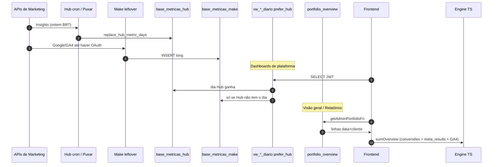
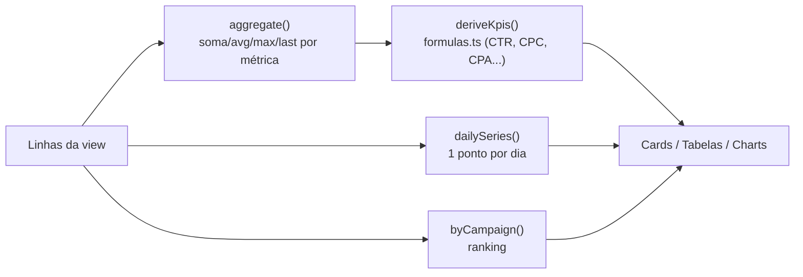
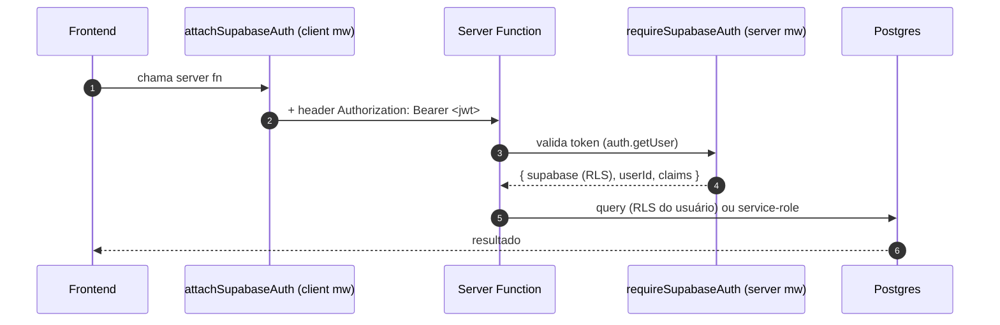
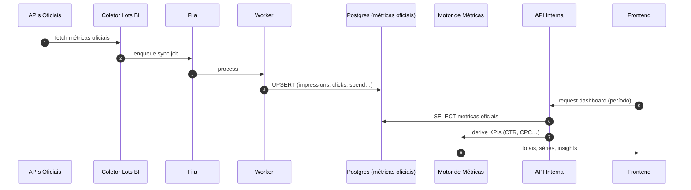

# Arquitetura — Fluxo de Dados

> Estado atual. Alvo (fila/workers) em [Arquitetura alvo](./target-architecture.md).

## Visão ponta a ponta (2026-09)

Ingestão: [current-pipeline-hub.md](../07-integrations/current-pipeline-hub.md).
Make legado: [current-pipeline-make.md](../07-integrations/current-pipeline-make.md).

---

## Etapa 1 — Ingestão (Hub + Make leftover)

**Fonte viva (Meta Ads e Instagram perfil):** Platform Hub. Crons GitHub Actions (03:10 /
03:25 UTC) e botão **Puxar métricas**. Writer: RPC `replace_hub_metric_days` em
`base_metricas_hub`. Fim da janela = ontem `America/Sao_Paulo`.

**Leftover Make:** ainda grava `base_metricas_make` (formato long). Google Ads e GA4
congelados em **2026-08-17** até OAuth Hub. Layout versionado na migration **52**.

Detalhe: [current-pipeline-hub.md](../07-integrations/current-pipeline-hub.md).

| coluna       | exemplo              |
| ------------ | -------------------- |
| `data`       | `2026-09-10`         |
| `cliente`    | `Antena`             |
| `plataforma` | `Google Ads`         |
| `metrica`    | `spend`              |
| `valor`      | `164824476` (micros) |
| `campanha`   | `Branding - Junho`   |

---

## Etapa 2 — Normalização (Postgres views)

A view `vw_metricas` (54) mistura Hub e Make **por dia**. `vw_metricas_normalizadas` aplica
aliases, spend Google `/ 1e6` e `current_user_clientes()`. Dashboards de plataforma **não**
leem essa cadeia: usam `vw_*_diario` + `prefer_hub`.

Overview admin: RPC `portfolio_overview` (não SELECT 8-union no browser).

---

## Etapa 3 — Leitura (Frontend + React Query)

Admin `/admin` e `/admin/relatorios` **não** fazem esse SELECT. Usam
`getAdminPortfolioFn` → `portfolio_overview` / `portfolio_clientes_ativos`.

O dashboard do **cliente** (`/dashboard`) ainda lê `vw_overview_cliente` com JWT + RLS.

As queries vão em `queryOptions` do React Query, `queryKey` com o período.

---

## Etapa 4 — Cálculo (Engine puro)

Nenhum componente calcula KPI. O fluxo é:

- `src/lib/platforms/engine.ts` — agregação genérica a partir de um `PlatformDef`.
- `src/lib/platforms/aggregations.ts` — estratégias (`sum`, `avg`, `max`, `min`, `first`, `last`, `custom`).
- `src/lib/platforms/formulas.ts` — fórmulas oficiais (fonte única de verdade).
- `src/lib/metrics.ts` — agregação específica do overview consolidado + insights.

> **Detalhe importante:** algumas métricas não são somáveis entre dias. Em
> `sumOverview()` (`src/lib/metrics.ts`), `google_spend` e `instagram_reach` usam **MAX por
> cliente** (cumulativo / contagem única), enquanto o resto soma. Isso é intencional e está
> comentado no código.

---

## Etapa 5 — Escrita (Server Functions)

Operações de escrita (cadastro, serviços, usuários, editorial) **não** passam pelo client
anon direto: vão por server functions que validam token + Zod e aplicam regras de papel.
Ver [Backend → API Reference](../03-backend/api-reference.md).

---

## Fluxo alvo (visão futura — não implementado)

Ver [Modelo de métricas](../04-database/metrics-model.md) para regra oficial vs derivada.
