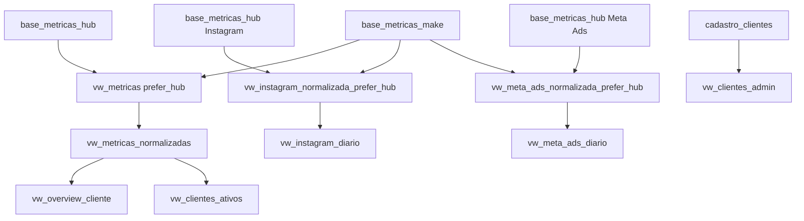

# Views Analíticas (`vw_*`)

Views críticas `vw_*` usam **`security_invoker = true`** (migration 51): o JWT do usuário
vale, RLS das tabelas-base aplica. Isolação extra em `vw_metricas_normalizadas` via
`current_user_clientes()` (plpgsql, cadastro + `client_access` — migration 55).

Dashboards de plataforma leem `vw_*_diario` prefer_hub. Visão geral / Relatórios **não**
varrem essas views no browser: usam RPC `portfolio_overview` / `portfolio_clientes_ativos`
(migrations 56–57).

Definições históricas: `08_aliases_e_null_guard.sql`. Prefer_hub e overview: 34, 36, 47,
49, 50, 54–57.

---

## Cadeia de derivação

---

## `vw_metricas_normalizadas` (base)

Uma linha por registro bruto, já tratado. Transformações:

1. `plataforma` → snake_case (`"Google Ads"` → `google_ads`).
2. `metrica` → minúsculas.
3. **Google Ads `spend`** convertido de micros: `valor / 1.000.000`.
4. `cliente` → nome canônico via `COALESCE(cliente_aliases.nome_canonico, base_metricas.cliente)`.
5. Filtro `valor IS NOT NULL`.
6. Filtro `cliente IN (current_user_clientes())`.

Colunas: `id, data, cliente, plataforma, metrica, valor, campanha, created_at`.

---

## Views por plataforma (pivot diário)

| View                        | Granularidade             | Colunas principais                                                                                                             |
| --------------------------- | ------------------------- | ------------------------------------------------------------------------------------------------------------------------------ |
| `vw_meta_ads_diario`        | data × cliente × campanha | … spend, results, conversions, cliques/vídeo/engajamento (46), conversas WhatsApp e page_engagements (58)                      |
| `vw_google_ads_diario`      | data × cliente × campanha | impressions, clicks, spend + ctr/cpc/cpm derivados na view                                                                     |
| `vw_ga4_diario`             | data × cliente            | active_users, sessions, engaged_sessions, pageviews, event_count, conversions, engagement_rate                                 |
| `vw_instagram_diario`       | data × cliente            | reach, interactions, accounts_engaged, likes, comments, saves, shares, profile_links_taps, engagement_rate                     |
| `vw_google_business_diario` | data × cliente            | profile_views, searches, direction_requests, website_clicks, phone_calls, messages, photo_views, reviews_count, reviews_rating |

> `vw_meta_ads_diario` usa `AVG` para cpc/cpm/ctr/frequency (médias do dia) e `SUM` para
> volumes. `vw_google_ads_diario` deriva ctr/cpc/cpm a partir dos totais (não média de médias).

---

## Views diárias — preferem Hub (Meta, IG, Google Ads, GA4)

Não leem `vw_metricas_normalizadas`. Cada uma lê `vw_*_normalizada_prefer_hub`
por `data + cliente` (Meta Ads e Google Ads também passam `campanha`):

1. Inclui a linha de `base_metricas_hub` quando existir.
2. Caso contrário, cai para `base_metricas_make`.

| Dashboard | View final | View intermediária | Migration |
| --------- | ---------- | ------------------ | --------- |
| Instagram | `vw_instagram_diario` | `vw_instagram_normalizada_prefer_hub` | 34, 47 |
| Meta Ads | `vw_meta_ads_diario` | `vw_meta_ads_normalizada_prefer_hub` | 36, 47, 58 |
| Google Ads | `vw_google_ads_diario` | `vw_google_ads_normalizada_prefer_hub` | 49 (spend `/ 1e6`) |
| GA4 | `vw_ga4_diario` | `vw_ga4_normalizada_prefer_hub` | 50 |

`ph_metricas_source` XOR **não** é virado por essas views. Sentinela Meta `campanha=''` +
results/conversions 0 **não** esconde Make. Google/GA4 Hub só preenchidos depois do OAuth.

Puxar métricas: Meta e Instagram no dashboard. Google/GA4 o wizard esconde até P14.
Ver [current-pipeline-hub.md](../07-integrations/current-pipeline-hub.md).

> Nota Meta Ads: `cpc`/`cpm`/`ctr`/`frequency` do pivot ficam `NULL` em dias Hub. O
> dashboard deriva no engine (`src/lib/platforms/meta-ads.ts`).

---

## `vw_overview_cliente` (consolidado)

Uma linha por `data × cliente`. Forma live = um `GROUP BY` + `FILTER` (migration 56).
A view 8-union no remoto causava timeout no JWT admin.

Admin `/admin` e `/admin/relatorios` leem via RPC `portfolio_overview` (não o PostgREST
na view). Colunas novas **só no fim** (57):

| Coluna | Origem |
| ------ | ------ |
| `meta_spend`, `google_spend` | spend |
| `total_impressions`, `total_clicks` | meta + google |
| `ga4_sessions`, `ga4_conversions` | GA4 |
| `instagram_reach`, `instagram_interactions` | Instagram |
| `meta_results`, `meta_conversions` | Meta Ads |
| `google_conversions` | Google Ads (ainda vazio sem Hub) |

KPI Conversões no app = `meta_results + google_conversions + ga4_conversions`.

---

## `vw_clientes_ativos` (status de ingestão)

Por cliente: `ultima_data_recebida`, `ultima_ingestao` (max `created_at`),
`plataformas_ativas` (array), `total_registros`. Alimenta listas de "status das contas".

---

## `vw_clientes_admin` (cadastro enriquecido)

Junta `cadastro_clientes` com: array de `servicos` ativos, `qtd_acessos` (de `client_access`),
flags de plataforma e IDs técnicos do Make (`instagram_username`, `facebook_ad_account_id`,
`google_ads_customer_id`, `ga4_property_id`, `tiktok_ativo`, `tiktok_ad_account_id`, …).

Disponível após migration **`05_cadastro_clientes_make_ids.sql`**. É o que `listClientes` lê
para o painel admin (`select("*")` no app).

---

## Notas de consumo no frontend

- O frontend dos **dashboards de plataforma** lê `vw_*_diario` com o client JWT (RLS).
- **Visão geral / Relatórios admin** usam `getAdminPortfolioFn` → RPC (não `select` na view).
- Não usar `getSupabaseAdmin()` nessas views: `auth.uid()` nulo → 0 linhas.
