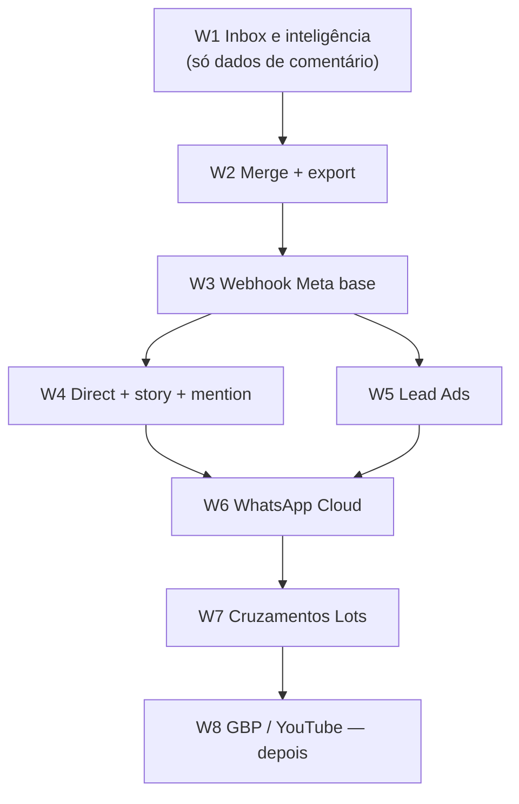

# CRM fase 2 — plano de implementação

Documento de execução. W1–W3 e mappers W4–W7 estão no código (branch da v1). Direct/Lead Ads/WhatsApp **live** continuam bloqueados por App Review / WABA.

Produto: [crm.md](./crm.md). Invariantes abaixo prevalecem sobre qualquer tela.

---

## 0. Invariantes (não negociar)

- CRM = audiência da **marca do cliente**, não `agency_leads` / Central.
- Hub **nunca** escreve Make. CRM **não** grava `base_metricas_hub`.
- Ciclo de Conteúdos (rascunho → publicar) **não muda**.
- `crm_field_facts` só com origem estruturada e consentida: Lead Ads, WhatsApp Cloud, ou dado que a própria pessoa enviou no Direct. **Nunca** regex de e-mail no texto do comentário.
- Graph **não** lista quem curtiu. Coletor `likes` permanece `impossible`.
- Custom Audience Meta: só e-mail/telefone **hasheados** que já existem em `crm_field_facts`. **Nunca** IGSID de comentador.
- Cliente lê audiência. Notas da agência e merge de identidades = admin. Responder comentário / Direct = admin na v2 (mesmo `canWrite` da v1).
- Coletores novos falham em silêncio (chip `scope_missing` / `error`); o resto do app continua.

---

## 1. Estado atual (ponto de partida)

Já existe:

| Peça | Onde |
| --- | --- |
| Schema pessoas/sinais/fatos | migration `61_crm_people_graph.sql` |
| Enums futuros | `dm`, `story_reply`, `lead_form`, `whatsapp`, `mention` em `crm_signal_kind`; identidades `email`/`phone`/`whatsapp` |
| Ingest comentários | `src/modules/crm/ingest/sync-comments.server.ts` + cron |
| UI lista + ficha | `CrmWorkspace.tsx` |
| Próxima ação | `next-action.ts` (`reply_comment`, `need_lead_form`, …) |
| Webhooks Meta | **não existem** (só crons GET) |
| Scopes Direct / Lead Ads | **não pedidos** no OAuth |

Trabalhar em **branch nova** `feat/crm-phase-2` a partir de `main` **depois** de merge da v1. Se a v1 ainda não tiver merge, continuar em `feat/crm-people-graph` e só abrir a branch nova após o merge — não misturar PRs gigantes.

---

## 2. Ordem de entrega (ondas)

Cada onda é um PR mergeável, com testes e docs. Não começar a onda N+1 sem a N estável em staging (exceto W1, que não depende de App Review).



W1 e W2 **não** pedem permissão nova no Meta App Dashboard. Entregar primeiro: valor imediato sobre os comentários já ingeridos.

W4–W6 exigem App Review Meta (e, no WhatsApp, conta WABA). Planejar lead time de review **em paralelo** com W1/W2.

---

## 3. W1 — Inbox e inteligência (comentários que já existem)

**Objetivo:** a equipe usa o CRM no dia a dia sem esperar Direct.

### 3.1 Inbox “responder agora”

Filtro persistente na UI (query `inbox=now`):

- `next_action.code === "reply_comment"` **ou**
- último sinal `comment`/`reply` nas últimas 48 h **e** `intent_score >= 70` **e** pessoa não ignorada.

Ordenação: intenção desc, depois `last_seen_at` desc.

Arquivos:

- `src/modules/crm/inbox.ts` — predicado puro + testes.
- `listCrmPeopleFn` — query param `view: "all" | "inbox" | "churn"`.
- `CrmWorkspace.tsx` — tabs `Todas` / `Responder agora` / `Em risco` (churn `em_risco` + `dormindo`).

Não criar tabela nova. Reusar `vw_crm_people_list` + filtro no server.

### 3.2 Ranking de pilares / posts que criam recorrência

Pessoa **recorrente** = `churn_state = recorrente` **ou** `signal_count >= 2` em mídias distintas.

Métrica por `ig_media_id` (e, se houver vínculo Conteúdos, por `pillar`):

- pessoas distintas com 1º sinal naquele post
- dessas, quantas voltaram (outro sinal em outro `source_id` depois)
- taxa de retorno 7/30/90 d

Arquivos:

- `src/modules/crm/cohort.ts` — funções puras (teste com fixtures de sinais).
- `src/modules/crm/ranking.server.ts` — SQL: `crm_signals` ⋈ `ig_media` ⋈ `conteudos` (left join; post sem Conteúdos ainda entra).
- UI: secção “O que traz gente de volta” no workspace (tabela compacta, período 7/30/90 já existente).

**Não** misturar volume anônimo de `ig_media.comments_count` com pessoas identificadas na mesma célula — duas colunas: `comentários (mídia)` vs `pessoas no CRM`.

### 3.3 Coorte: 1º sinal no post X ainda ativo em 7/30/90

Definição:

1. `first_seen_at` da pessoa cai no período.
2. `source_id` do **primeiro** sinal = `ig_media.id` (Graph) ou `ig_media_id` interno — fixar um e documentar no mapper.
3. Ativa em N dias = existe sinal com `occurred_at` em `(first_seen_at, first_seen_at + N days]`.

Server fn `getCrmCohortsFn({ cadastroClienteId, days, igMediaId? })`.

UI: na ficha do post (ou sheet no CRM) “Destas N pessoas, X% ainda falaram em 30 d”.

### 3.4 Fila de intenção com dono

Schema (migration `62_crm_inbox.sql`):

```sql
alter table crm_people
  add column owner_user_id uuid references auth.users (id) on delete set null;

create index crm_people_owner_idx
  on crm_people (cadastro_cliente_id, owner_user_id)
  where ignored_at is null;
```

- Só admin atribui. Cliente vê o nome se houver, não edita.
- `nextAction` ganha códigos: `reply_dm` (W4), `send_lead_form` (W5), `open_whatsapp` (W6). W1 só estende `reply_comment` + owner.
- Server: `assignCrmPersonFn` (admin). Lista `view=inbox` pode filtrar `mine`.

### 3.5 Testes W1

- `inbox.test.ts`, `cohort.test.ts` (puros).
- Vitest server: ranking não conta pessoa ignorada; coorte não usa `comments_count` da mídia como proxy de pessoa.

### 3.6 Docs W1

Atualizar [crm.md](./crm.md) + tutoriais admin/cliente (tabs inbox / coorte). Changelog + `releases.ts`.

**Critério de pronto:** admin abre CRM → tab Responder agora → atribui dono → vê ranking de posts com taxa de retorno. Zero scope Meta novo.

---

## 4. W2 — Merge manual + export de fatos reais

**Objetivo:** não duplicar a mesma pessoa quando o Direct/Lead Ads chegar; exportar só o que existe.

### 4.1 Merge de identidades

UI admin na ficha: “Unir com outra pessoa” (busca por `@` / display name no mesmo `cadastro_cliente_id`).

Transação (RPC `crm_merge_people(from_id, into_id)` `security definer`, só admin):

1. Mover `crm_identities` (conflito de `unique (cadastro, provider, identifier)` → apagar a do `from` se igual).
2. Mover `crm_signals`, `crm_field_facts`, `crm_person_notes`.
3. Recalcular `crm_person_stats` do `into`.
4. Marcar `from` com `merged_into_id` + `ignored_at` (não apagar — auditoria).
5. Não inventar fato PII no merge.

Domain: `src/modules/crm/merge.ts` (regras puras: mesmo cliente; não merge cruzado; VIP do `into` vence se qualquer um for VIP).

### 4.2 Export

`exportCrmPeopleFn` → CSV no browser (sem job):

Colunas permitidas: `person_id`, `display_name`, `ig_username` (se identity instagram), `first_seen`, `last_seen`, `intent_score`, `churn_state`, `email` **somente se** existe `crm_field_facts` kind email, `phone` idem.

Proibido: IGSID, tokens, notas da agência no CSV do cliente. Admin CSV pode incluir notas (flag `includeNotes`, default false).

Teste: fixture sem `field_facts` → colunas email/phone vazias, nunca preenchidas a partir do texto do comentário.

**Critério de pronto:** unir `@joao` (comentário) com a mesma pessoa depois do Lead Ads (W5) sem duas fichas; CSV sem PII fantasma.

---

## 5. W3 — Base de webhook Meta (infra, sem produto visível)

**Objetivo:** um endpoint assinado, idempotente, pronto para W4/W5. Nenhum coletor “live” ainda.

Hoje só existem crons GET. Criar:

- `server/routes/api/webhooks/meta.get.ts` — verificação `hub.mode=subscribe` + `hub.verify_token`.
- `server/routes/api/webhooks/meta.post.ts` — `X-Hub-Signature-256` HMAC SHA256 do raw body.

Env (não commitar valores):

- `META_WEBHOOK_VERIFY_TOKEN`
- `META_APP_SECRET` (já pode existir para OAuth — reutilizar; não duplicar nome)

Parser: `src/modules/crm/ingest/meta-webhook.ts`

- Validar assinatura **antes** de JSON.parse (Nitro: raw body).
- Dedup: `crm_signals.source_id` único por `(cadastro, source, source_id)` — já previsto; se não houver unique, adicionar na `62` ou `63_crm_webhooks.sql`.
- Responder `200` em < 5 s; trabalho pesado em fila síncrona curta (mesmo padrão fail-soft dos crons). Se o Graph retryar, o unique segura.

Cadastro: tabela `crm_webhook_subscriptions` (cadastro, object `instagram|page|whatsapp`, status) **ou** reusar `crm_collector_state`. Preferir `collector_state` para não proliferar tabelas.

Docs ops: `docs/05-operations/` — callback URL pública, campos a assinar no App Dashboard (`comments`, `messages`, `mention`, `leadgen`).

Testes: HMAC válido/inválido; replay do mesmo `comment_id` não duplica sinal.

**Critério de pronto:** ngrok/staging recebe GET challenge; POST inválido → 401; POST válido → 200 e zero linhas de produto ainda (handler no-op por `object` desconhecido).

---

## 6. W4 — Direct, story reply, mention

**Objetivo:** a mesma pessoa (IGSID) ganha sinais `dm` / `story_reply` / `mention`. PII no Direct **só** se a pessoa mandar e-mail/telefone de forma estruturada (não regex no texto livre na v2 — igual comentário). Se no futuro houver quick-reply / ice breaker com campo explícito, aí sim `field_facts`.

### 6.1 OAuth / App Review

Scopes (Instagram Login + Page, alinhado ao plugin `instagram_organic`):

- `instagram_manage_messages`
- `pages_messaging` (se o Direct passar pela Page)

Env kill-switch: `META_REQUEST_IG_MESSAGES_SCOPE` (default on em prod quando App Review passar; off = chip `planned`).

Re-login obrigatório, mesmo padrão de comentários.

### 6.2 Graph client

Estender `instagram-graph-client.ts` (não criar cliente paralelo):

- Conversas / mensagens (campos que a Graph v21+ permitir para IG User).
- **Não** assumir histórico ilimitado: webhook é a fonte; backfill opcional só das conversas abertas (cap + cursor em `crm_ingest_cursors`, collector `dm`).

Webhook fields: `messages`, `messaging_postbacks`, `mention`; stories via `comments` em story media ou campo `story_insights` — confirmar na doc Meta **no dia da implementação** (stories expiram ~24 h; persistir o sinal no CRM na hora).

### 6.3 Ingest

- `ingest/map-graph-dm.ts`, `map-graph-mention.ts` — puros + testes.
- `ingest/sync-dms.server.ts` — fail-soft; `collector_state.dm`.
- Stitch: mesmo `provider=instagram` + IGSID → mesma `crm_people`. Sem IGSID → não criar pessoa (log + skip).

### 6.4 Responder Direct

`replyCrmDmFn` (admin): Graph send. Espelhar `replyCrmCommentFn`. Rate limit / erro → toast, não throw na UI.

UI ficha: timeline mistura comment + dm; botão Responder some se collector `scope_missing`.

`next-action.ts`: se último sinal é `dm` e intenção alta → `reply_dm`.

### 6.5 Cron

Opcional: `instagram-crm-dm-sync` depois do comments, só backfill raso. Webhook é o caminho feliz.

**Critério de pronto:** mensagem no Direct da marca aparece na ficha em < 1 min (webhook) ou no próximo backfill; comentário antigo da mesma IGSID não gera segunda pessoa.

---

## 7. W5 — Lead Ads (único caminho estruturado a e-mail/telefone/endereço vindo do Ads)

**Objetivo:** `crm_field_facts` reais. Stitch com a pessoa do Instagram **quando** o lead form trouxer IGSID / Page-scoped id / e-mail que já exista.

### 7.1 Plugin / scopes

Lead Ads vive na **Page** + Ad Account. Opções:

1. Estender plugin `meta_ads` (já tem token de ads) **se** o token tiver `leads_retrieval` + `pages_manage_ads` / `pages_read_engagement` conforme App Review atual.
2. Ou coletor no CRM que reutiliza a conexão Page do `instagram_organic`.

Preferir **(1)** se o cadastro já conecta Meta Ads; senão fallback na Page. Documentar os dois chips: `lead_ads` `scope_missing` vs `live`.

Scope: `leads_retrieval`. Kill-switch `META_REQUEST_LEADS_SCOPE`.

### 7.2 Ingest

Webhook `leadgen` (W3 já roteia) **ou** poll `/{form_id}/leads` com cursor.

Mapper `ingest/map-lead-form.ts`:

- Criar/atualizar `crm_identities` `email` / `phone` / `leadgen`.
- `crm_field_facts` com `source=lead_ads`, `raw_field` (ex. `email`, `full_name`, `street_address`) **só** se o form tiver o campo.
- Sinal `kind=lead_form`, `place=ad` / `campaign_id` se vier.
- Stitch: e-mail igual → mesma pessoa; senão pessoa nova (admin faz merge W2).

**Não** puxar o público customizado da Meta para “reconhecer” comentadores.

### 7.3 UI / próxima ação

- Ficha mostra fatos com selo “Lead Ads”.
- `next-action`: se PII completa e churn em risco → `watch` / campanha (W7), não “precisa de formulário”.
- Inbox: leads novos nas últimas 24 h na tab Responder agora (ação humana: WhatsApp/e-mail fora do Lots até W6).

**Critério de pronto:** um lead de teste grava e-mail na ficha; export CSV inclui o e-mail; comentário sem form continua sem e-mail.

---

## 8. W6 — WhatsApp Cloud API (plugin Hub novo)

**Objetivo:** fechar o volume de Ads `messaging_conversations_started` em pessoa real (`wa_id`).

### 8.1 Plugin

Novo plugin Hub `whatsapp_cloud` (padrão `instagram_organic` / `ga4`):

- OAuth / token permanente (System User ou embedded signup — decidir na spike de 1 dia; não misturar com Instagram Login).
- Secrets no cofre Hub existente.
- Coletor CRM `whatsapp` lê a conexão do plugin; CRM não guarda token próprio.

Fora de CRM: este plugin **não** alimenta `base_metricas_hub` na v1 do plugin (só mensagens → CRM). Métricas de conversa de Ads continuam no plugin `meta_ads`.

### 8.2 Webhook

Objeto `whatsapp_business_account`. Reusar `/api/webhooks/meta` se a Meta unificar, **ou** `/api/webhooks/whatsapp` se o header/assinatura for o da Cloud API (HMAC com `WHATSAPP_APP_SECRET`). Spike: um arquivo de verificação de assinatura compartilhado.

Mapper: `wa_id` → identity `whatsapp`. Texto da conversa = sinal `whatsapp`. Template outbound da marca = `brand_reply` (não inflar intenção).

PII: telefone **é** o `wa_id` (fato `phone` source=whatsapp). E-mail só se a pessoa enviar em fluxo estruturado (list message / flow), não regex.

### 8.3 Janela 24 h

UI deve mostrar se a janela de serviço está aberta. Sem janela: não oferecer “Responder” (só template aprovado — **fora** da v6.1; v6.1 = inbound + ficha + stitch).

### 8.4 Cruzamento Ads

W7 usa isto: campanha com action `messaging_conversations_started` vs `count(distinct person)` com primeiro sinal `whatsapp` no mesmo dia. Até W6 existir, o Relatório continua só com o volume anônimo.

**Critério de pronto:** mensagem inbound cria/atualiza pessoa; mesmo telefone que veio no Lead Ads (W5) mergeia ou sugere merge; chip `whatsapp=live`.

---

## 9. W7 — Cruzamentos Lots + Custom Audience

Só depois de W1 (coorte) + pelo menos um coletor PII (W5 ou W6).

| Superfície | O que mostrar | O que não fazer |
| --- | --- | --- |
| Conteúdos | No post: pessoas CRM + taxa retorno (W1.2) | Não alterar workflow de aprovação |
| Relatório | Bloco “audiência identificada vs volume” (comentários mídia vs pessoas) | Não somar IGSID como conversão Ads |
| Meta Ads | Tabela campanha: conversas iniciadas (insights) vs pessoas ingeridas (W6) | Não usar isso como verdade de ROAS |
| Custom Audience | Job admin: hash SHA256 e-mail/telefone de `field_facts` consentidos → Graph | Upload de IGSID / comentadores |

Arquivos prováveis:

- `src/modules/crm/crossovers.server.ts`
- Card no hub Relatório (feature flag se o bloco for experimental)
- `src/modules/crm/custom-audience.server.ts` — só admin, confirmação explícita, log de quantos hashes (nunca o PII no log)

LGPD: texto na UI “só contactos que preencheram formulário / WhatsApp”. Sem opt-in registrado no Lots, não subir audiência.

---

## 10. W8 — Depois (não planejar sprint agora)

- Google Business Profile reviews → `kind=review`, identity gbp.
- YouTube comments (Data API + canal conectado).
- Templates WhatsApp outbound / filas.
- Cliente respondendo comentário (hoje só admin).

Continua **fora**: likers, GA4-como-pessoa sem User-ID consentido, e-mail no texto do comentário.

---

## 11. Schema previsto (migrations)

| # | Onda | Conteúdo |
| --- | --- | --- |
| 62 | W1+W2 | `owner_user_id`, `merged_into_id`, unique sinais se faltar |
| 63 | W3 | opcional `crm_webhook_receipts` (idempotência `message_id`) se unique de signal não bastar |
| 64 | W5 | nada se `field_facts` já cobrir; senão `consent_source` |
| 65 | W6 | plugin Hub tables padrão + `wa_id` já é identity |

RLS: mesmo padrão 61 (cliente lê o seu cadastro; notas admin-only; merge/export admin).

Regenerar `database.types.ts` via MCP após cada apply.

---

## 12. Arquivos âncora (não reinventar)

| Área | Caminho |
| --- | --- |
| Domain | `src/modules/crm/*.ts` |
| Ingest | `src/modules/crm/ingest/` |
| UI | `src/components/lots/crm/CrmWorkspace.tsx` |
| Graph IG | `plugins/instagram_organic/api/instagram-graph-client.ts` |
| OAuth scopes | `instagramOrganicOauthScopes()` + env kill-switch |
| Cron | `server/routes/api/cron/` + `.github/workflows/` |
| Webhook (novo) | `server/routes/api/webhooks/meta.*` |
| Plugin WA (novo) | `src/modules/platform-hub/plugins/whatsapp_cloud/` |

TDD: mapper + stitch + cohort + inbox **antes** da UI. Coletor: teste de skip-rules (`scope_missing`, token morto).

---

## 13. App Review / ops (caminho crítico W4–W6)

Começar o dossiê **durante W1**, não no dia do código:

1. Meta App Dashboard: permissões, callback webhook, Page subscribed apps.
2. Relogin de todos os cadastros (comentários já exigiram uma vez; Direct/Leads exigem de novo).
3. Policy URLs (privacidade) já usadas no OAuth — revisar se Direct/Leads mudam o texto.
4. WhatsApp: WABA, número, webhook verify, template (templates = W8).

Kill-switches por coletor: se review negar, chip `planned` e o CRM de comentários segue.

---

## 14. Critérios globais de aceite

- Comentários v1 continuam iguais (regressão: vitest ingest comments + OAuth).
- Pessoa = stitch por identity; zero PII inventada nos testes de export.
- Cliente não vê notas nem merge.
- Falha de Direct/WA não quebra sync de mídia nem Conteúdos.
- Custom Audience recusa payload sem `field_facts`.

---

## 15. Estimativa relativa (engenharia, sem review Meta)

| Onda | Esforço | Bloqueio externo |
| --- | --- | --- |
| W1 Inbox / ranking / coorte / owner | M | Não |
| W2 Merge + export | S | Não |
| W3 Webhook base | S | URL pública HTTPS |
| W4 Direct / story / mention | L | App Review messages |
| W5 Lead Ads | M | App Review `leads_retrieval` |
| W6 WhatsApp plugin | L | WABA + review |
| W7 Cruzamentos + audience | M | W5 ou W6 em live |

S ≈ 1–2 dias · M ≈ 3–5 · L ≈ 1–2 semanas de calendário (código), review pode ser mais.

---

## 16. Primeiro PR concreto (quando executar)

Branch `feat/crm-phase-2` (ou continuar `feat/crm-people-graph` se v1 ainda aberta):

1. Domain `inbox.ts` + `cohort.ts` + testes.
2. Migration 62 `owner_user_id` + `merged_into_id`.
3. Server list views + assign.
4. UI tabs + ranking + owner.
5. Docs + release note.

W2 pode ir no mesmo PR se couber; senão PR seguinte imediato (merge precisa existir antes de Lead Ads).
