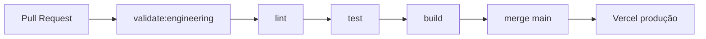

# CI/CD

---

## Estado atual

| Item                   | Status                               |
| ---------------------- | ------------------------------------ |
| GitHub Actions         | ✅ `.github/workflows/ci.yml`        |
| Lint no PR             | ✅ `npm run lint`                    |
| Testes no PR           | ✅ `npm run test` (Vitest)           |
| Build no PR            | ✅ `npm run build`                   |
| Validação engenharia   | ✅ `npm run validate:engineering`    |
| Gate local             | ✅ `npm run check`                   |
| Deploy automático      | ✅ Vercel no merge `main`            |
| Deploy Cloudflare      | 🟡 `deploy.yml` manual (não é prod)  |
| Crons Hub              | ✅ Actions (`*-cron.yml`) em `main`  |
| Migrations automáticas | ❌ Manual / MCP `apply_migration`    |

---

## Pipeline implementado



### Workflow: `CI` (`.github/workflows/ci.yml`)

Dispara em `push` e `pull_request` para `main`.

| Step        | Comando                                  |
| ----------- | ---------------------------------------- |
| Install     | `npm ci`                                 |
| Engineering | `npm run validate:engineering`           |
| Lint        | `npm run lint`                           |
| Test        | `npm run test`                           |
| Build       | `npm run build` (env placeholders no CI) |

### Gate local

```bash
npm run check
# = validate:engineering + lint + test + build
```

Requer `.env` local para o passo `build` (ver `.env.example`).

---

## PR template

Checklist alinhado ao handbook: `.github/pull_request_template.md`

---

## Deploy

### Produção (hoje)

Merge em `main` → **Vercel** em `https://lotsbi.leandromajr.com`. Ver [Deployment](./deployment.md).

Crons de métricas: workflows `meta-ads-campaigns-sync-cron.yml`, `instagram-profile-sync-cron.yml`,
`google-ads-sync-cron.yml`, `ga4-sync-cron.yml` (secrets `APP_URL` + `CRON_SECRET`). Primeiro
run após o merge de 2026-09-11 pode exigir `workflow_dispatch` se a janela UTC já passou.

### Cloudflare (preparado — ADR-0012)

Workflow **manual**: `.github/workflows/deploy.yml` — **não** é o domínio de produção.

1. Configure secrets no GitHub: `CLOUDFLARE_API_TOKEN` + variáveis `OFFICIAL_*` / `VITE_OFFICIAL_*`
2. Actions → **Deploy (Cloudflare)** → confirmar com `deploy`
3. Local: `npm run build && npm run deploy:cloudflare`

> Mantenha Lovable ativo até validar paridade em produção.

### Pipeline alvo (pós-cutover)

```yaml
steps:
  - npm run check
  - deploy Cloudflare (secrets reais)
  - smoke test
```

Ver [ADR-0012](../02-architecture/adr/0012-internal-infrastructure-transition.md).

---

## Migrations

Gate **manual**: aplicar SQL no Supabase antes/depois do deploy conforme compatibilidade.
Ver [Migrations](../04-database/migrations.md).

---

## Referências

- [ADR-0011](../02-architecture/adr/0011-engineering-system-foundation.md)
- [Testing](../09-standards/testing.md)
- [Governança](../09-standards/governance.md)
