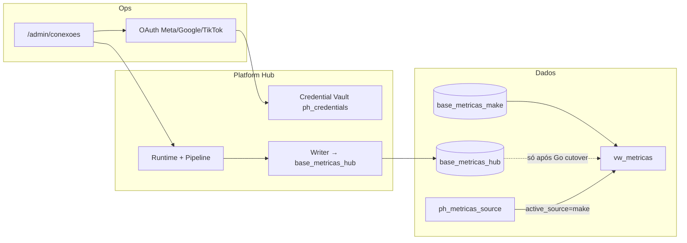

# Platform Hub — Hub de Conexões

> **Status: CONGELADO (ago/2026)** — Marcos 1–4 + correções de métricas estão no código e na branch `feature/marco1-hub-meta-piloto`.  
> **Não** flipar `ph_metricas_source` para `hub`. **Não** tratar esta branch como deploy de produção.  
> Retomada: checklist humano em [manual-ops-checklist](./manual-ops-checklist.md).

Esta pasta é a **aba dedicada** do Knowledge Center ao Platform Hub (`/admin/knowledge` → Platform Hub).

---

## Como funciona



| Peça | Papel |
|------|--------|
| **Make** | Continua alimentando dashboards (`active_source = make`) |
| **Hub Official** | Coleta APIs oficiais → grava **só** em `base_metricas_hub` (dual-run) |
| **Vault** | Tokens OAuth criptografados em `ph_credentials` |
| **Connect scopes** | Métricas (`ads_read`, …) — dialog padrão |
| **Publish scopes** | Opt-in — botão **Reconectar + Publish** (após Use Cases Meta) |
| **Scheduler** | CLI `hub:sync-official` + workflow Actions (secrets manuais) |

**Regra de ouro:** UI/admin consomem o kernel via `createAdminHubStack()`. Não alterar Runtime/Pipeline/Registry/Contracts sem ADR. **Nunca** escrever em tabelas Make pelo Hub.

---

## O que foi feito (até o freeze)

### Marcos produto

| Marco | Entrega | Estado |
|-------|---------|--------|
| **1** | UX Conexões, piloto Meta Agência Lots, dual-run | Feito no código · piloto vivo |
| **2** | CLI sync/diagnose/cutover, schedule Actions | Código pronto · secrets Actions = manual |
| **3** | Badges, atenção Hub, Kanban mobile | Feito |
| **4** | Publish foto Facebook Page | Código pronto · Use Cases Meta = manual |

### Engenharia / dados (ago/2026)

- Writer Hub **idempotente** (replace por chave natural) — sem somar métricas a cada sync
- Migration **32** + índice único `uq_base_metricas_hub_natural_key` (aplicado no Supabase official)
- Janela Meta padrão **7 dias** (`America/Sao_Paulo`)
- Paridade pontual Meta Ads **2026-08-04 = 740** impressões no Hub (Make intocado)
- Botão **Reconectar + Publish** + `META_OAUTH_INCLUDE_PUBLISH_SCOPES`
- Scripts: compare / dedupe / align Hub↔Make; `scripts/ops/hub-sync-eligible.cmd`
- `deploy.yml` mapeia secrets Hub/OAuth (valores ainda manuais no GitHub)

### Piloto

| Campo | Valor |
|-------|--------|
| Cliente | Agência Lots (`cadastro_id` 15) |
| Connection | `37ebe453-f60f-4375-a6b7-97229f87050f` |
| Estágio | `dual_run` |
| Branch | `feature/marco1-hub-meta-piloto` (GitHub only — sem cutover prod) |

---

## O que deve ser feito (quando descongelar)

Ordem completa e explicações: **[manual-ops-checklist.md](./manual-ops-checklist.md)**.

| Prioridade | Item | Tipo |
|------------|------|------|
| M0 | Desbloquear Meta Graph (`API access blocked`) | Manual Meta |
| M1–M2 | Use Cases Page + roles no App | Manual Meta |
| M3 | `gh auth` + secrets Actions (cron sync) | Manual GitHub |
| M4 | Reconectar + Publish + teste de post | Manual browser |
| M5 | Go dual-run → `hub:cutover -- --to=hub --confirm=hub` | Decisão ops |
| P0 | Secrets Hub no runtime Cloudflare (além do YAML) | Deploy prod |
| P1 | Google/TikTok piloto, alertas, RLS `ph_*` | Eng pós-freeze |

Até M5: dashboards **sempre Make**.

---

## Leitura recomendada

| # | Documento | Para quê |
|---|-----------|----------|
| 1 | [Checklist manual (fim do plano)](./manual-ops-checklist.md) | Descongelar — passos humanos |
| 2 | [Handoff RC1](./handoff-rc1.md) | Arquitetura e onde mexer no código |
| 3 | [Dual-run / Go-No-Go](./marco1-dual-run-checklist.md) | KPIs do piloto |
| 4 | [Marco 2 — Scheduler + cutover](./marco2-scheduler-and-cutover.md) | Sync CLI / Actions |
| 5 | [Marco 4 — Publish Meta](./marco4-publish-meta.md) | Facebook Page |
| 6 | [Próximos passos](./next-steps.md) | Backlog P0–P2 |
| 7 | [Admin UI](../06-dashboards/platform-hub-admin.md) | Rotas operador |
| 8 | [ENVIRONMENT_VARIABLES](../ENVIRONMENT_VARIABLES.md) | OAuth / writers |

---

## Mapa do código

```
src/modules/platform-hub/           # Kernel (Runtime, Pipeline, Registry, Health, plugins)
src/modules/platform-hub-bridges/   # ph_* persistence, writers Hub, Gate A
src/modules/platform-hub-admin/     # Server fns, OAuth factory, CLI sync/diagnose/cutover
src/components/lotus/platform-hub/  # UI /admin/conexoes/*
src/routes/oauth/*/callback.tsx
supabase/migrations-official/28…32  # Hub + homologação + natural key
.github/workflows/hub-sync-official.yml
```

---

## Comandos

```bash
npm run hub:doctor
npm run hub:sync-official -- --eligible          # ou --connection=<uuid>
npm run hub:diagnose -- --connection=<uuid>
npm run hub:cutover                              # dry-run; flip só com --confirm
npm run hub:snapshot -- --connection=<uuid>
node scripts/engineering/hub-compare-metricas-day.mjs "Agência Lots" "YYYY-MM-DD"
```

---

## ADRs

- [ADR-0020](../02-architecture/adr/0020-engineering-contracts-platform-hub.md) — contracts  
- [ADR-0021](../02-architecture/adr/0021-platform-hub-ports-fase-0.md) — ports  
- [ADR-0022](../02-architecture/adr/0022-hub-registry-fase-1.md) — registry  
- [ADR-0023](../02-architecture/adr/0023-modulo-estrutura-fase-2.md) — módulos  
- [ADR-0024](../02-architecture/adr/0024-platform-hub-runtime-meta-parity.md) — Meta parity  

---

## AI Workspace

Context Pack em `/admin/ai-workspace` inclui **Platform Hub** e **Current Data Sources**. Esta aba (`docs/13-platform-hub/`) é a fonte humana; o AI Workspace só sintetiza.
