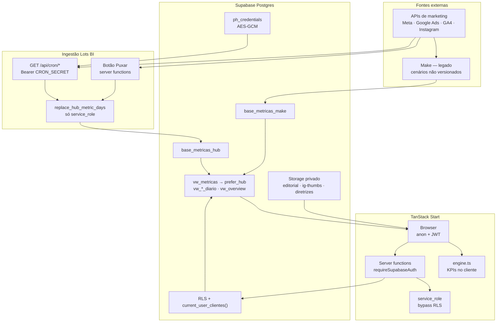
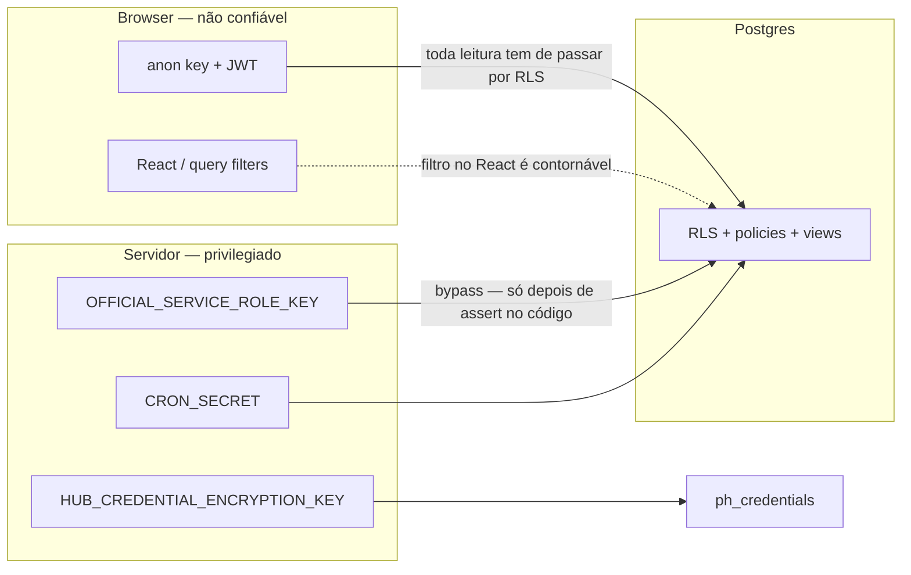

# Plano de varredura de segurança — Lots BI

> **Esta fase é somente leitura.** Nenhum `ALTER`, migration, deploy, mudança de Auth settings ou rotação de chave. Sem escrever no banco. Parar e reportar no primeiro P0 reproduzível de **cliente A ler dados do cliente B**.

Este documento é autônomo: descreve como a plataforma funciona hoje e o protocolo completo do que precisa ser feito. Modelo vivo de defesa em profundidade: [Segurança](../03-backend/security.md).

| | |
| --- | --- |
| Projeto Supabase | `ywvhoctcmibjitvwkkhb` |
| Repo | `supabase-magic-portal/` |
| Escopo | Isolamento multi-tenant + superfícies que o furam (views, REST, server functions, Storage, Hub, cron, Auth, Make) |
| Itens | 48 (S-00 … S-113) |
| Prioridade | **P0** isolamento/secrets · **P1** endurecimento · **P2** enumeração |

---

## Índice

1. [Como a plataforma funciona](#1-como-a-plataforma-funciona)
2. [Limites de confiança](#2-limites-de-confiança)
3. [Vetores P0 a priorizar](#3-vetores-p0-a-priorizar-ainda-não-confirmados)
4. [Protocolo](#4-protocolo--o-que-fazer)
5. [Ordem de execução](#5-ordem-de-execução)
6. [Formato do relatório](#6-formato-do-relatório)
7. [Referências](#7-referências)

---

## 1. Como a plataforma funciona

Lots BI é um app **full-stack TypeScript** (TanStack Start + React 19) em cima de **Supabase** (Postgres + Auth + RLS). Não há servidor backend dedicado. Há três caminhos de dado:

1. **Browser** lê views com chave **anon + JWT** (sujeito a RLS).
2. **Server functions** validam o Bearer; umas usam o client com RLS do usuário, outras importam **service_role** (bypass total de RLS).
3. **Cron** (`GET /api/cron/*`) autentica com `CRON_SECRET` e age sobre **todas** as conexões ativas.

O isolamento multi-tenant **não está na UI**. Guards de rota são UX. A barreira real é `client_access` + `current_user_clientes()` / `current_user_cadastro_cliente_ids()` + RLS.

A chave histórica do cliente ainda é **nome em texto** (`cliente`, `cliente_aliases`), com `cadastro_cliente_id` em paralelo. Esse dual é o vetor estrutural mais perigoso do produto ([ADR-0004](../02-architecture/adr/0004-chave-de-cliente-por-nome-e-aliases.md)).



### 1.1 Coleta

| Origem | Destino | Quem dispara | Isolamento que precisa valer |
| --- | --- | --- | --- |
| **Make** (legado, ainda ligado) | `base_metricas_make` no formato long: `data`, `cliente` (texto), `plataforma`, `metrica`, `valor`, `campanha` | Cenários externos, não versionados neste repo | O texto `cliente` + aliases não podem mapear A em B. A credencial Make vê todos os IDs técnicos. |
| **Hub official_api** | `base_metricas_hub` com replace-by-day | Cron noturno + botão Puxar: Meta Ads, Instagram perfil, Google Ads, GA4 | Cron autentica com secret (sem JWT de usuário). RPC `replace_hub_metric_days(p_cliente, …)` não pode aceitar o tenant errado. |
| **Instagram publicações** | `ig_media` + thumbs no Storage | Cron `instagram-media-sync` | Path de storage = `cadastro_id`. |
| **Publicação agendada** | `content_cards` → Graph | Cron `conteudos-publish-due` | Job com service_role publica o card certo, não o de outro cliente. |

Tokens OAuth ficam em `ph_credentials` (AES-256-GCM). Variável dedicada: `HUB_CREDENTIAL_ENCRYPTION_KEY` (fallback perigoso: `OFFICIAL_SERVICE_ROLE_KEY`). O writer do Hub **nunca** escreve `base_metricas_make`.

Rotas cron (auth compartilhado em `server/lib/cron-auth.ts`):

- `/api/cron/meta-ads-campaigns-sync`
- `/api/cron/instagram-profile-sync`
- `/api/cron/google-ads-campaigns-sync`
- `/api/cron/ga4-profile-sync`
- `/api/cron/instagram-media-sync`
- `/api/cron/conteudos-publish-due`

OAuth callbacks: `/oauth/meta/callback`, `/oauth/google/callback`, `/oauth/tiktok/callback`. Self-service do cliente (portal): Instagram orgânico e Meta Ads (`hub-client.server.ts`).

### 1.2 Views / entrega / engine

Dashboards não leem a tabela bruta. Cadeia atual:

```
base_metricas_hub  ∪  base_metricas_make
        ↓
   vw_metricas          (prefer_hub: Hub ganha o dia; Make no resto)
        ↓
   vw_metricas_normalizadas   (aliases + WHERE current_user_clientes())
        ↓
   vw_*_diario  /  vw_overview_cliente  /  vw_ig_media_dashboard
        ↓
   Frontend (anon + JWT)  →  engine.ts (CTR, CPC, séries, ranking)
```

Ponto da migration **54**: `vw_metricas` tem `GRANT SELECT` para `authenticated` e **não** filtra o usuário — o isolamento depende da RLS de `base_metricas_make` / `base_metricas_hub`. Views recentes usam `security_invoker = true`. Views antigas já foram `SECURITY DEFINER` ([ADR-0003](../02-architecture/adr/0003-views-security-definer.md)) — a varredura precisa confirmar o estado **ao vivo**, não só o git.

O frontend assume views já normalizadas (snake_case, spend Google em moeda, nome canônico). Nenhuma tela deve ser a barreira de autorização.

### 1.3 Front

| Rota | Papel | O que lê |
| --- | --- | --- |
| `/dashboard` | cliente / admin | `vw_overview_cliente` |
| `/cliente/$slug/*` | ambos (RLS filtra) | plataformas, conexões, plano, brandbook, publicações |
| `/aprovacoes` | cliente | cards do próprio `cadastro_cliente_id` |
| `/admin/*` | admin (guard UX) | CRUD, Hub, Agency OS, debug, AI Workspace |

Papéis: `admin` (agência) e `cliente`. Sessão JWT no `localStorage` (`sb-{projectId}-auth-token`). Redirect pós-login: `/admin` ou `/dashboard` (módulo Access).

Guards (`_authenticated/route.tsx`, `admin/route.tsx`) **não são segurança**. A barreira real é RLS + `assertAdmin` / assert de tenant nas server functions.

### 1.4 Back

O “backend” é:

| Peça | Arquivo / pasta | Privilégio |
| --- | --- | --- |
| Client anon | `src/integrations/supabase/client.ts` | RLS do JWT |
| Service-role | `src/integrations/supabase/client.server.ts` | Bypass RLS — **nunca** `VITE_` |
| Middleware | `requireSupabaseAuth` + `attachSupabaseAuth` | 401 se Bearer inválido |
| Server functions | `admin.functions.ts`, `editorial`, approval, Hub, access, agency-os, diretrizes, notifications | ~150 `createServerFn` |

Padrão esperado: `requireSupabaseAuth` → Zod → `assertAdmin` **ou** assert de tenant. Vários módulos **depois** do assert chamam `getSupabaseAdmin()` — se o assert falhar, o Postgres não salva.

Self-service Hub (`hub-client.server.ts`): `assertOwnCadastroAccess` e depois `getSupabaseAdmin()`. IDOR nesse assert = dados/tokens de todos os clientes.

### 1.5 Banco e Auth

- RLS nas tabelas de domínio. Catálogo: [rls-policies.md](../04-database/rls-policies.md) (parcialmente desatualizado frente às migrations 28–54).
- Funções `SECURITY DEFINER`: `current_user_clientes()`, `current_user_cadastro_cliente_ids()`, `has_role`, `is_platform_owner`, `replace_hub_metric_days`, `access_invalidate_auth_sessions`, guards de trigger.
- Storage privado: `editorial-media`, `ig-media-thumbs`, `diretrizes-marca`. Path esperado: primeiro folder = `cadastro_cliente_id`.
- Auth: email/senha, convite via admin, lifecycle `invite_pending → awaiting_password → active → disabled / revoked` em `access_accounts`.
- `user_metadata.lots_bi` é **editável pelo usuário** — não pode autorizar. Papel mora em `user_roles`.
- MFA / SSO (P38) **não** faz parte do estágio final operacional — registrar como gap.

### 1.6 Multi-tenant em uma frase

> Um JWT `cliente` só pode **ver e mutar** linhas cujo cliente está em `client_access` (nome canônico e/ou `cadastro_cliente_id`). Admin vê todos os clientes ativos. Service-role e cron não são um usuário — qualquer bug no código que os usa ignora RLS.

---

## 2. Limites de confiança



| Superfície | Confiança | Se vazar |
| --- | --- | --- |
| Anon key | Pública (bundle) | Baixo, se RLS estiver certa |
| JWT do cliente | Browser (`localStorage`) | XSS = sessão do tenant |
| `OFFICIAL_SERVICE_ROLE_KEY` | Só servidor | Bypass total, todos os clientes |
| `CRON_SECRET` | Servidor + GitHub Actions | Sync/publicação de todos os clientes |
| `HUB_CREDENTIAL_ENCRYPTION_KEY` | Só servidor | Tokens Meta/Google de todos |
| Guards de rota | UX | Zero |

---

## 3. Vetores P0 a priorizar (ainda não confirmados)

Observados no código e nas migrations. **Não são buracos confirmados.** A varredura existe para provar ou descartar.

| Vetor | Por que está na lista |
| --- | --- |
| Isolamento por nome (ADR-0004) | Métricas e várias policies usam texto + `cliente_aliases`, não só FK. Alias errado = troca de tenant. |
| `vw_metricas` sem filtro de usuário | GRANT ao `authenticated`; isolamento só via RLS das tabelas make/hub (migration 54). |
| `service_role` depois do assert | Hub cliente, collect, uploads e admin importam `supabaseAdmin`. IDOR no assert = dados de todos. |
| `ph_credentials_admin_all` | Admin JWT pode `SELECT` o ciphertext. Cliente não deveria. Chave com fallback da service_role. |
| Cron Bearer | Um secret dispara sync de todas as conexões ativas. |
| Signup vs invite-only | [security.md](../03-backend/security.md) ainda cita signup público; Auth v3 diz UI desligada. Precisa bater com o Dashboard Auth. |
| `user_metadata` | Namespace `lots_bi` no JWT; em Supabase `raw_user_meta_data` é editável pelo usuário. |

---

## 4. Protocolo — o que fazer

Marcar `- [ ]` no git se a execução for acompanhada em PR; nesta fase os checkboxes são o roteiro, não evidência de execução.

### Fase 0 — Preparação

| ID | Pri | Superfície | O que fazer |
| --- | --- | --- | --- |
| S-00 | P0 | Governança | Congelar o alvo: nenhum ALTER, migration, deploy, mudança de Auth settings ou rotação de chave. Só leitura. |
| S-01 | P0 | Contas de prova | Quatro identidades **reais**: cliente A, cliente B (tenants distintos), admin da agência, usuário `disabled`/`revoked`. Guardar JWT e `user_id`. Não colocar senha em logs. |
| S-02 | P0 | Alvos | Inventariar URLs: produção, preview Lovable, local, projeto Supabase, REST `/rest/v1`, Storage, Auth, `/api/cron/*`, OAuth callbacks. |
| S-03 | P1 | Matriz de ameaça | Fechar STRIDE no modelo Lots BI: spoofing (JWT/cron/OAuth), tampering (aliases, `client_access`, metadata), repudiation (audit logs), information disclosure (views/storage), DoS (cron/sync), elevation (admin/owner/service_role). |

### Fase 1 — Inventário vivo do Postgres

| ID | Pri | Superfície | O que fazer |
| --- | --- | --- | --- |
| S-10 | P0 | Advisors Supabase | Rodar advisors de segurança e performance (MCP `get_advisors`). Catalogar RLS desligada, policies permissivas, views `SECURITY DEFINER`, functions sem `search_path`. |
| S-11 | P0 | Tabelas `public` | Listar toda tabela em `public` e `storage.objects`: RLS on/off, policies por role (`anon`, `authenticated`, `service_role`), GRANTs. Tabela sem RLS ou GRANT para `anon` = P0. |
| S-12 | P0 | Views `vw_*` | Para cada view: `security_invoker` vs `SECURITY DEFINER`. Isolamento vem da RLS da base **ou** de `WHERE current_user_clientes()`? Sem os dois = vazamento. |
| S-13 | P0 | `vw_metricas` | A 54 concede SELECT a `authenticated` e a view **não** filtra `current_user_clientes`. Provar se RLS de make/hub cobre admin+cliente e se aliases não cruzam tenants. |
| S-14 | P0 | Funções `SECURITY DEFINER` | Inventário: `current_user_clientes`, `current_user_cadastro_cliente_ids`, `has_role`, `is_platform_owner`, `replace_hub_metric_days`, `access_invalidate_auth_sessions`, `ensure_owner_admin_for_user`, triggers de guard. Quem tem `EXECUTE` (`PUBLIC` / `anon` / `authenticated` / `service_role`). `search_path` fixo. |
| S-15 | P1 | `base_metricas` legado | Confirmar se a tabela antiga ainda existe, tem RLS sem policy, e se o client ainda a consulta. |
| S-16 | P1 | GraphQL / Realtime | Se `pg_graphql` ou Realtime estiverem ligados, repetir todos os SELECTs via GraphQL e `postgres_changes`. RLS precisa valer igual. |
| S-17 | P1 | Policies conhecidas abertas | Revisar ao vivo: `cliente_aliases_select_auth` (todo authenticated), `servicos_select_all_auth`, GRANT SELECT de IDs técnicos em `cadastro_clientes`, `ph_*` só-admin, `agency_*` só-admin, `core_audit_log` só-admin. |

### Fase 2 — Prova cross-tenant

Este é o teste que responde à pergunta de negócio. Sem a prova positiva, a negativa é cega.

| ID | Pri | Superfície | O que fazer |
| --- | --- | --- | --- |
| S-20 | P0 | Prova positiva | JWT do cliente A: GET nas views e tabelas do próprio tenant. Esperado: só nomes/IDs de A. Registrar contagem. |
| S-21 | P0 | Prova negativa REST | JWT A, sem filtro e com filtro do cliente B, em: `vw_overview_cliente`, `vw_*_diario`, `vw_ig_media_dashboard`, `cadastro_clientes`, `content_cards`, `ig_media`, `planos_estrategicos`, `cliente_diretrizes`, `app_notifications`, `client_access`, `profiles`. Esperado: **0 linhas de B**. |
| S-22 | P0 | Chave dupla nome vs ID | Procurar `client_access` só com `cliente_nome`, `cadastro_cliente_id` nulo, nome divergente do canônico, aliases A→B. Confirmar se A vê métricas/cards de B por texto. |
| S-23 | P0 | IDOR de slug | Abrir `/cliente/{slug-B}` autenticado como A. Esperado: vazio/403, nunca dashboard de B. Repetir com `slugify`, case, espaços, UUID, id numérico. |
| S-24 | P1 | Admin vs cliente | Admin vê todos (by design). Cliente nunca. Usuário sem `client_access`: zero métricas. Revoked/disabled: sessão não consulta dados. |

### Fase 3 — PostgREST / Data API

UI ignorada. Anon key + JWT, como um atacante faria.

| ID | Pri | Superfície | O que fazer |
| --- | --- | --- | --- |
| S-30 | P0 | Enum PostgREST | GET `/rest/v1/` (OpenAPI). Listar tabelas/views/RPCs expostas. Qualquer `ph_credentials`, `ph_oauth_states`, `access_audit_log`, `agency_notes` visível a cliente é P0. |
| S-31 | P0 | Embeds / `or=` | Bypass: `or=(cliente.eq.B)`, embeds `cadastro_clientes.select=*,client_access(*)`, inner join views, `Prefer: count=exact`, `Accept: text/csv`. RLS não pode ceder. |
| S-32 | P0 | RPCs privilegiadas | Como authenticated A: `replace_hub_metric_days`, `access_invalidate_auth_sessions`, `ensure_owner_admin_for_user`, `has_role(outro_uid,'admin')`, `current_user_clientes`. Esperado: permission denied / só o próprio escopo. |
| S-33 | P0 | Colunas sensíveis | A não lê de outro cadastro: `facebook_ad_account_id`, `ga4_property_id`, `google_ads_customer_id`, `valor_mensal`, e-mails de `profiles`, `payload_encrypted`, oauth state, debug traces. |
| S-34 | P1 | Escrita REST | Como A: INSERT/UPDATE/DELETE em `content_cards`, `client_access`, `user_roles`, `cadastro_clientes`, `base_metricas_hub`/`make`, `ph_connections`. Cliente só o que a policy de aprovação/material permite. |

### Fase 4 — Server functions / IDOR

| ID | Pri | Superfície | O que fazer |
| --- | --- | --- | --- |
| S-40 | P0 | Hub cliente (`service_role`) | `hub-client.server.ts` usa `getSupabaseAdmin()` depois de `assertOwnCadastroAccess`. Chamar get/create/oauth/status com `cadastroClienteId` e `connectionId` de B. Esperado: Forbidden, nunca dado/token de B. |
| S-41 | P0 | Puxar métricas | Server fns Meta/IG/Google/GA4 (collect) com cadastro de B como usuário A. Assert de dono **antes** do sync. Writer não substitui dias de outro cliente. |
| S-42 | P0 | Conteúdos / cards | `cards.server`, `client-cards`, planning, library, publish: `cardId`, `cadastro_cliente_id` e upload URL de B. `createClientMaterialUploadUrl` não emite path/token de outro tenant. |
| S-43 | P0 | Inventário `createServerFn` | Percorrer todos os handlers (admin, access, approval, hub-admin, agency-os, diretrizes, scoped-portal, notifications). Cada um: `requireSupabaseAuth`, Zod, `assertAdmin` ou assert de tenant, e se usa service_role. |
| S-44 | P1 | Admin IDOR interno | Admin não-owner chama funções owner-only (AI Workspace, `ensure_owner`). Mass assignment em `updateCliente` (trocar slug/IDs). `listUsers` paginação vazar hashes. |

### Fase 5 — Storage

| ID | Pri | Superfície | O que fazer |
| --- | --- | --- | --- |
| S-50 | P0 | Buckets | Confirmar `public=false` em `editorial-media`, `ig-media-thumbs`, `diretrizes-marca`. Listar objects com JWT A sem prefixo. Esperado: só pasta do cadastro A (`foldername[1] ∈ current_user_cadastro_cliente_ids()`). |
| S-51 | P0 | Signed URL / TUS | Reusar token/signedUrl de A em path de B; expiração; TUS resumable em outro object. Storage policy + ticket server-side precisam falhar. |
| S-52 | P1 | URLs no HTML | `permalink`, `media_url`, `thumbnail_url` do Instagram e signed downloads no portal A não apontam mídia de B. |

### Fase 6 — Hub / OAuth / Cron / vault

| ID | Pri | Superfície | O que fazer |
| --- | --- | --- | --- |
| S-60 | P0 | OAuth | State reuse, state de B no callback de A, `redirectAfter` open-redirect (`//`, `@`, `\`, encoded), CSRF. `sanitizeOAuthRedirectAfter` existe — tentar bypass. Tokens não vão para o browser. |
| S-61 | P0 | Vault `ph_credentials` | SELECT `payload_encrypted` como cliente (deve falhar). Como admin via REST: ciphertext só, sem plaintext. Em produção: `HUB_CREDENTIAL_ENCRYPTION_KEY` dedicada, **não** fallback da service_role. |
| S-62 | P0 | Cron | GET `/api/cron/*` sem Bearer, Bearer errado, secret em query string/logs. Timing 401 vs 503. `CRON_SECRET` só no servidor/GitHub Actions, não no bundle Vite. |
| S-63 | P1 | Identidade errada | Cliente A no self-service Instagram/Meta: descobrir identities e tentar gravar `ad_account`/page de B (ou conta Meta compartilhada). Writer `replace_hub_metric_days(p_cliente)` não aceita nome de outro tenant só porque o cron tem o secret. |

### Fase 7 — Auth / sessão

| ID | Pri | Superfície | O que fazer |
| --- | --- | --- | --- |
| S-70 | P0 | Signup / convite | Confirmar no Dashboard Auth: signup público desligado (docs divergem). Aceitar convite com e-mail diferente. Recovery Mode reenviar convite. |
| S-71 | P0 | Sessão vs lifecycle | Disable/revoke: JWT antigo ainda lê dados? `access_invalidate_auth_sessions`. JWT expiry. Ban Auth vs `access_accounts`. Senha alterada não invalida outros devices. |
| S-72 | P0 | `user_metadata` | Usuário A faz `updateUser` em `raw_user_meta_data.lots_bi` / role. Nenhuma policy, `has_role` ou guard autoriza por `user_metadata` (só `app_metadata` / tabelas). |
| S-73 | P1 | Endurecimento | Password policy, rate limit login, MFA/SSO (P38 — registrar como gap), JWT em `localStorage` (XSS = sequestro de sessão), `redirectTo` de convite só `APP_URL`. |

### Fase 8 — Front / SSR

| ID | Pri | Superfície | O que fazer |
| --- | --- | --- | --- |
| S-80 | P0 | Leituras no browser | Dashboards leem views direto com anon+JWT. Nenhuma query no client adiciona `.or()`, ignora RLS ou usa service_role. Bundle sem `VITE_` de service_role. |
| S-81 | P1 | Guards são UX | `/admin/*`, `/admin/debug`, `/admin/ai-workspace`, `/admin/conexoes` como cliente: redirect. Barreira real = RLS + `assertAdmin` — repetir via server fn, não só UI. |
| S-82 | P1 | SSR / cache | SSR TanStack Start não cacheia view de A e serve a B. React Query `queryKey` inclui cliente. Erros não vazam nome/spend de outro tenant. |

### Fase 9 — Segredos e cadeia de supply

| ID | Pri | Superfície | O que fazer |
| --- | --- | --- | --- |
| S-90 | P0 | Segredos | Scan estático (gitleaks/trufflehog) no repo + histórico git: service_role, `CRON_SECRET`, OAuth secrets, encryption key. `.env` gitignored. Nenhuma `VITE_` com service_role. |
| S-91 | P0 | Lovable / CI / Cloudflare | Quem tem acesso ao projeto Lovable, GitHub secrets, Cloudflare, Supabase Dashboard. Logs de Actions não imprimem Bearer. Preview não aponta para prod DB com service_role extra. |
| S-92 | P1 | Dependências | `npm audit` / OSV no lockfile (`@lovable.dev/vite-tanstack-config`, `supabase-js`, TanStack). Sem upgrade — só relatório. |

### Fase 10 — Make / ingestão

| ID | Pri | Superfície | O que fazer |
| --- | --- | --- | --- |
| S-100 | P0 | Make | Cenários escrevem `base_metricas_make` com o texto `cliente`. Conferir credencial Make (vê todos os IDs), webhook inbound se existir, e se um cenário pode gravar linhas no nome do cliente B. |
| S-101 | P1 | IDs técnicos | `cadastro_clientes` guarda `facebook_ad_account_id` etc. Cliente A não lê o cadastro de B. Logs externos (Make, Graph, Google) sem PII de outro tenant no mesmo job visível a cliente. |

### Fase 11 — Avançado e relatório

| ID | Pri | Superfície | O que fazer |
| --- | --- | --- | --- |
| S-110 | P1 | Headers / browser | CSP, CORS do Supabase (allowed origins = `APP_URL`, não `*`), clickjacking, cookies Secure/HttpOnly se houver, HSTS no Cloudflare. |
| S-111 | P1 | Rate limit / DoS | Login, convite, Puxar métricas, cron, signed upload. Um cliente não esgota quota Graph/Google de outro via IDOR de collect. |
| S-112 | P2 | Timing / enumeração | Resposta de slug inexistente vs sem permissão; e-mail de convite; `/auth`. Evitar confirmar existência de clientes/usuários. |
| S-113 | P0 | Relatório | Achados P0/P1/P2 com evidência (request/response **sem secrets**), reprodução, impacto (qual cliente vaza para quem), correção proposta. **Sem aplicar correção nesta fase.** |

---

## 5. Ordem de execução

```
0 preparação
  → 1 advisors / inventário SQL          (mais barato; acha RLS morta)
  → 2 / 3 prova com dois JWTs no REST     (decide se há vazamento)
  → 4 IDOR nas server functions com service_role
  → 5 Storage
  → 6 Hub / OAuth / cron
  → 7 Auth
  → 8 Front / SSR
  → 9 Segredos / cadeia
  → 10 Make
  → 11 Headers + relatório
```

Parar no primeiro P0 reproduzível de cross-tenant. Não “continuar a lista” em cima de um vazamento já provado.

---

## 6. Formato do relatório

Cada achado:

| Campo | Conteúdo |
| --- | --- |
| ID | `S-xx` de origem + `FIND-nn` |
| Prioridade | P0 / P1 / P2 |
| Superfície | view, REST, server fn, storage, cron, … |
| Impacto | Cliente **A** consegue **o quê** do cliente **B** |
| Evidência | Método, path, status, trecho de body **sem tokens/PII extra** |
| Reprodução | Passos mínimos |
| Correção proposta | O que mudar (não aplicar nesta fase) |

Não incluir: service_role, `CRON_SECRET`, ciphertext descriptografado, senhas, JWTs completos.

---

## 7. Referências

- [Segurança (modelo vivo)](../03-backend/security.md)
- [Auth](../03-backend/auth.md) · [Auth, Access e Admin](../02-architecture/auth-access-admin.md)
- [RLS](../04-database/rls-policies.md) · [Views](../04-database/views.md) · [Schema](../04-database/schema.md)
- [Fluxo de dados](../02-architecture/data-flow.md) · [Estado atual](../02-architecture/current-state.md)
- [ADR-0003 views DEFINER](../02-architecture/adr/0003-views-security-definer.md)
- [ADR-0004 chave por nome](../02-architecture/adr/0004-chave-de-cliente-por-nome-e-aliases.md)
- [ADR-0005 anon vs service-role](../02-architecture/adr/0005-server-functions-anon-vs-service-role.md)
- [Variáveis de ambiente](../ENVIRONMENT_VARIABLES.md)
- Script já existente (portal cliente, somente leitura): `scripts/audit-client-portal.mjs`
- Migrations relevantes: `30_parallel_metricas_homologation.sql`, `51_views_security_invoker.sql`, `54_overview_prefer_hub_and_make_rls.sql`, `28_platform_hub.sql`
